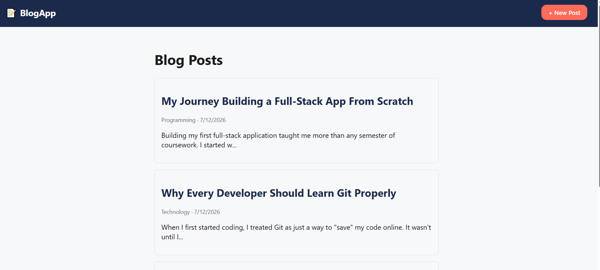
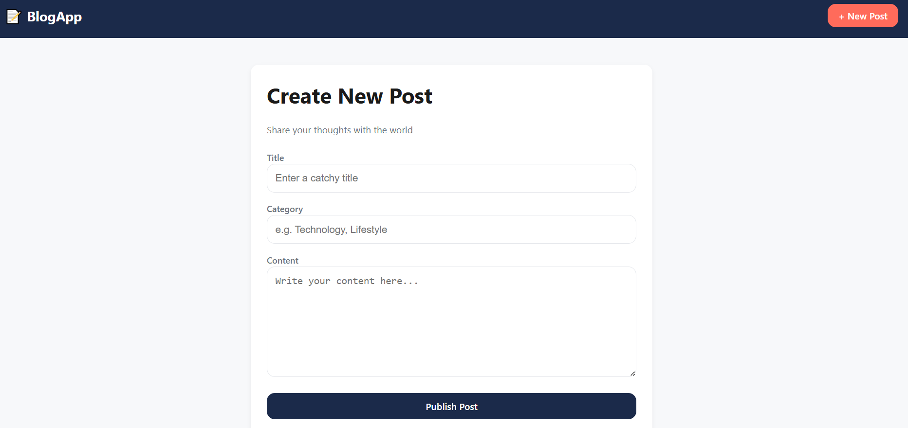
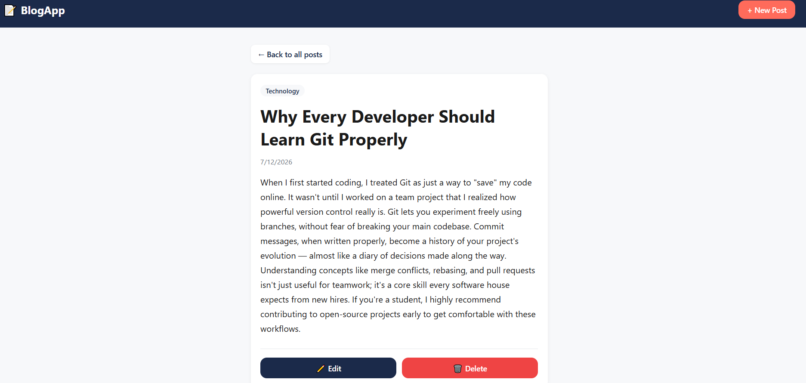

# Blog App 📝

A full-stack blog application with complete CRUD functionality, built with React, Node.js/Express, and MongoDB.

## Features
- Create, read, update, and delete blog posts
- Category tagging for posts
- Clean, card-based UI with custom Navy/Coral theming
- RESTful API backend with MongoDB persistence

## Screenshots

| Home | Create Post | Post Detail |
|------|-------------|-------------|
|  |  |  |

## Tech Stack
**Frontend:** React (Vite), React Router, Axios
**Backend:** Node.js, Express, MongoDB, Mongoose

## Project Structure
BlogApp/
├── backend/     # Express API + MongoDB models
└── frontend/    # React UI

## Getting Started

**Backend:**
```bash
cd backend
npm install
npm run dev
```

**Frontend:**
```bash
cd frontend
npm install
npm run dev
```

## Future Improvements
- User authentication (login/signup)
- Search and filter posts by category
- Pagination for large post lists
- Rich text editor for post content

## Author
Uns Yaseen